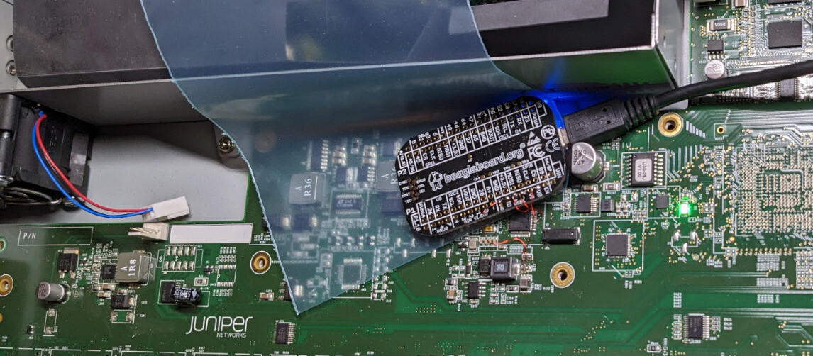
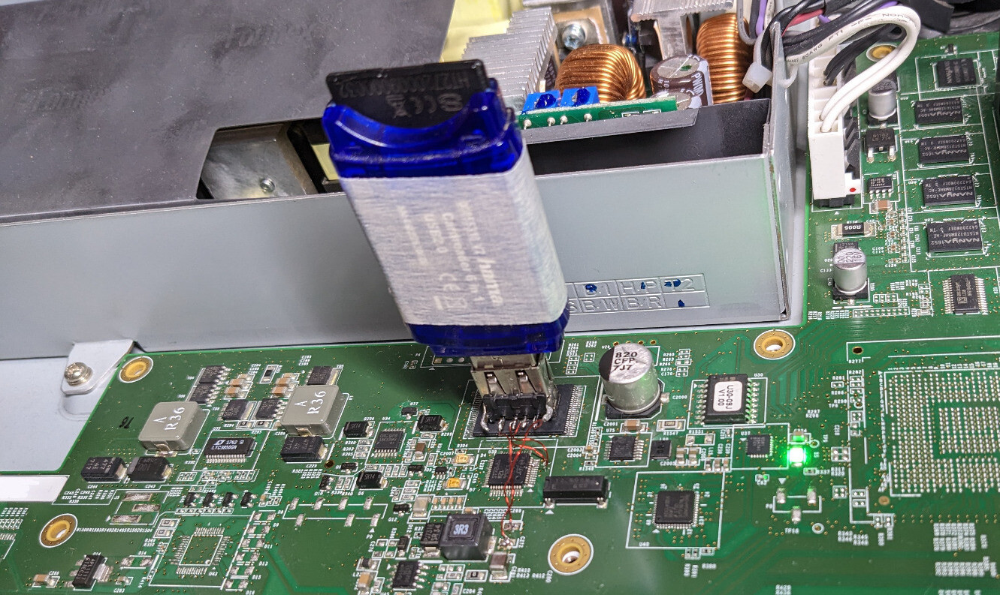
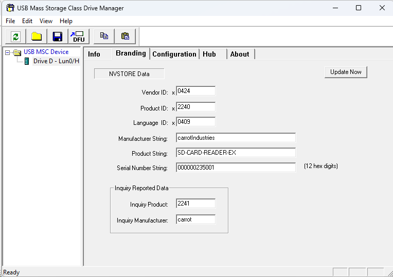
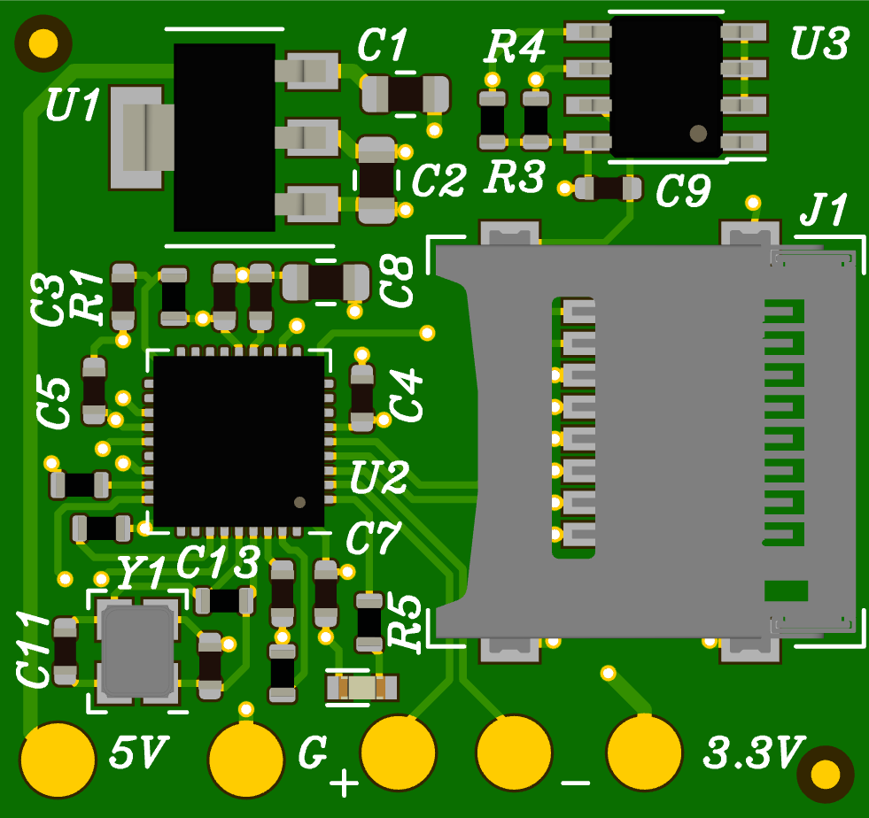
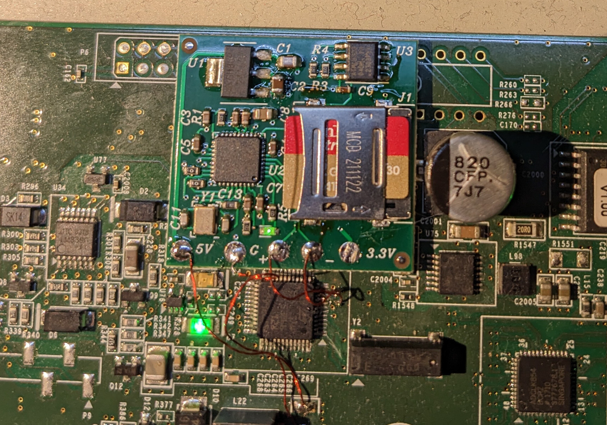
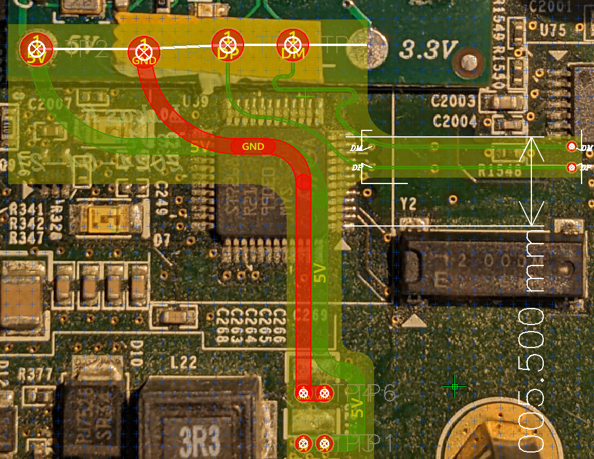
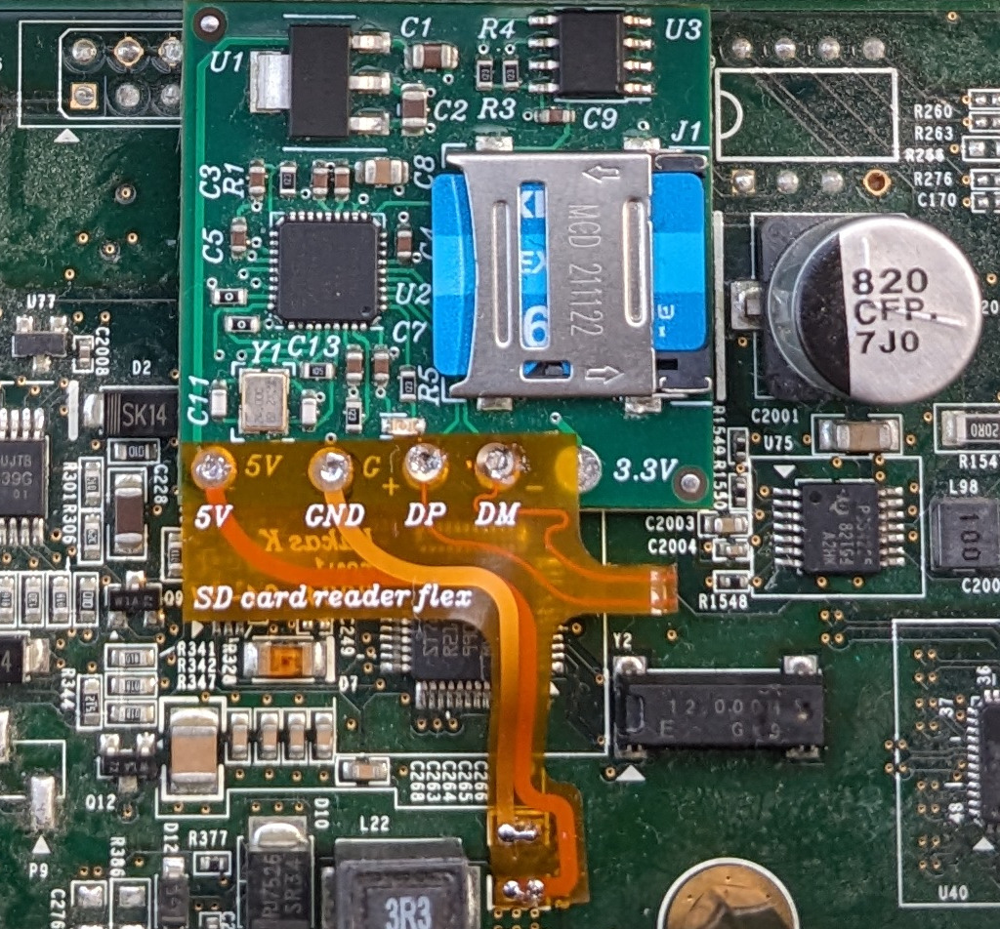
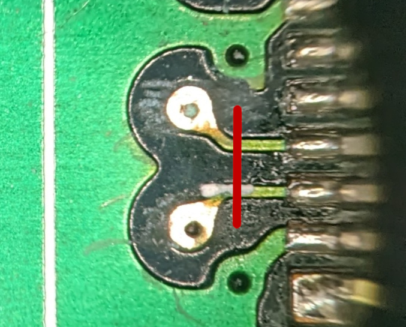
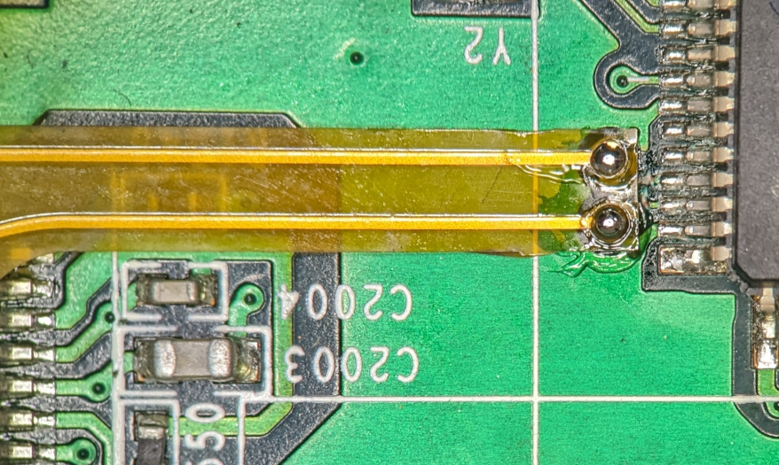
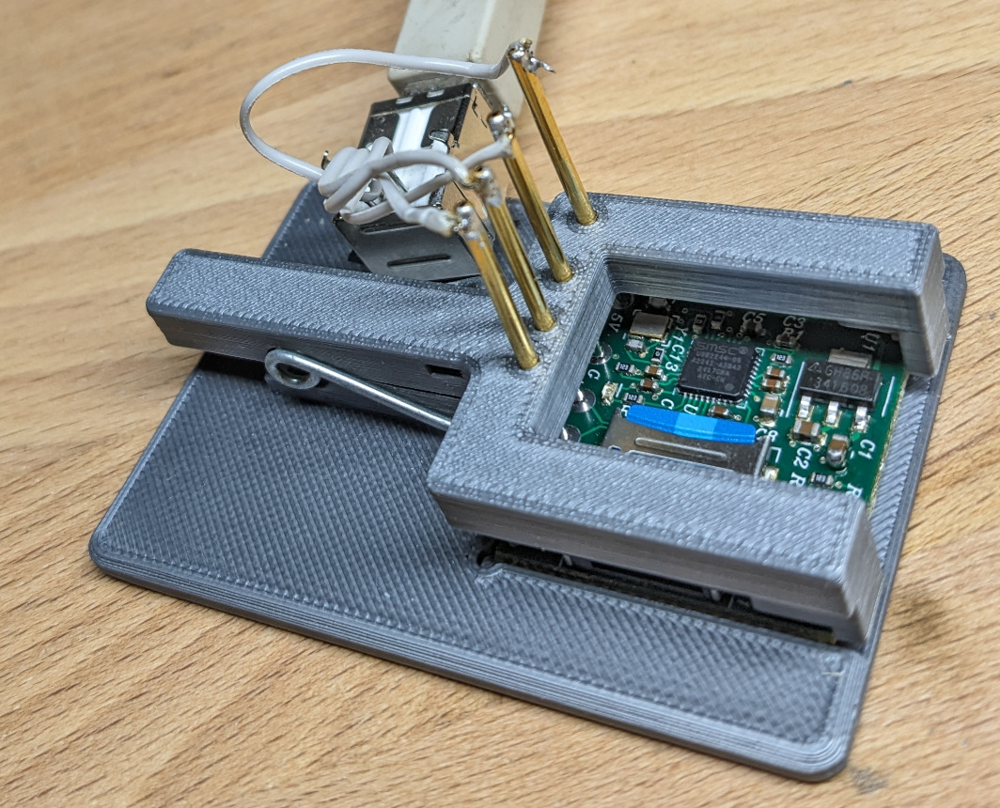

# SD-CARD-READER-EX

## Introduction

After over 10 years of continuous service, the flash memory in Juniper 
EX3300 switches tends to fail due to wear, resulting in frequent `fsck` 
errors or switches not booting at all. Since everything else about 
these switches is still good and they still have desirable 
specifications with up to 48 1000BASE-T optionally PoE+-enabled ports, 4 
SFP+ 10G uplink ports and full layer 3 support, I started investigating 
what could be done about the broken flash.

## What didn't work

In the EX3300, the flash mass storage is implemented as a raw NAND 
flash chip soldered to the main board, so the first idea was to replace 
it with a brand-new one. This however is easier said then done since 
the board has many internal planes, making hot-air reworks challenging 
to say the least. Nevertheless, I tried replacing the flash chip by cutting off the leads, carefully desoldering the leftover pins and soldering in a new one. That however didn't work and it seemed like the flash chip wasn't recognized by the controller. Either the the rework didn't work for whatever reason or the new flash requires initialization with an unobtanium software.

Taking a closer look at the flash controller, an [ST72682](https://www.st.com/resource/en/datasheet/st72682.pdf), it turns out that it is in fact a USB 2.0 flash controller as one would usually find in a USB flash drive. So for some reason Juniper decided the best way to attach NAND flash to the Marvell-made SoC was USB. While a strange design decision, this opens up a lot of avenues for flash replacement.

Obviously, the first thing I tried was disconnecting the USB flash controller by lifting its two USB data pins, soldering in a USB A socket instead and plugging in a USB flash drive.

Now, it's a good time for a quick interlude to explain why replacing the entire nonvolatile memory works at all on this family of switches. Aside from the often-defective NAND flash, there's a small NOR flash on board containing the U-Boot-based bootloader. It has enough smarts to completely reinstall the operating system to the NAND flash from a USB drive. That way, it's possible to recover this family of switches from a completely blank NAND flash.

While the USB drive connected to the newly-added USB socket was detected by the bootloader and installer, it repeatedly got stuck at various points during the installation procedure. I tried a wide variety of USB drives of various speeds and sizes, to no avail.

Taking a closer look at the installer revealed that it invokes a shell script that pokes the installation target device with some vendor-specific SCSI commands to test for bad blocks. So I suspected that all tested USB drives for some reason didn't like these specific SCSI commands which caused then to get stuck.

## An idea

Since I don't have a USB protocol analyzer at hand to see what's really going on between the switch and the USB drive, I had to get creative and try other USB mass storage implementations that allow for better debugging and analysis than a typical USB flash drive. My first approach involved trying to build a USB mass storage device from an STM32F4Discovery board and an SD card by stringing together the USB mass storage and SD card code from the STM32 HAL. While it technically worked, the end result was not satisfactory as it was much too slow (in the order of tens of kB/s) and unreliable.

This got me thinking of of using an embedded Linux board that supports USB device operation. After mentally going through the boards I acquired over the last years, I recalled having a [PocketBeagle](https://www.beagleboard.org/boards/pocketbeagle-original) I got at a trade show years ago. Much to my surprise I managed to find it. After patching the device tree to make the USB1 interface that's available on the pin headers work as a device, I configured it as mass storage device backed by a 1GB image using the usual USB gadget mechanism.

While impractical for continuous use, this approach worked perfectly and I was able to install and boot JunOS.

There being a microSD card in the PocketBeagle got me wondering if I could skip the PocketBeagle and just use plain SD card reader. So I reinstalled the USB socket and plugged in a generic SD card reader.

Much to my surprise, the SD card reader didn't seem to be bothered by the vendor-specific SCSI commands that confused all USB drives and I could install and boot JunOS with this much more practical contraption.

## Let's build an SD card reader!

Rather than trying to find an SD card reader of the right form factor and hoping that it'll keep using a controller IC that's not harmed by the particular SCSI commands so that it's safe to recommend to other people, I thought this was a good excuse for building a custom SD card reader.

The most important component of an SD card reader obviously is the controller IC. A search on DigiKey surfaced the [USB2244](https://www.microchip.com/en-us/product/usb2244) from Microchip (ex SMSC) which appears to be the only easily-obtainable USB SD card controller from western vendors. It can optionally interface to an I²C EEPROM for customizing USB descriptors. As typical for anything with USB, it contains an 8051 core.

The vendor provides some Windows-only [software](https://www.microchip.com/en-us/software-library/obj-files-for-usb224x) for writing the external EEPROM. It looks just about as one expects and is implemented using MFC as it's common for this sort of application. 

Getting it to run was somewhat involved as the MSI installer refuses to run on 64 bit Windows. However, after extracting the relevant executable using `msiextract` from [msitools](https://gitlab.gnome.org/GNOME/msitools), the program runs just fine.

 Sniffing the USB traffic with Wireshark revealed that it's just sending some vendor-specific [SCSI commands](cmds.md).

Hardware-wise it's as simple as expected: It requires a 3.3&nbsp;V power supply, a 24&nbsp;MHz crystal, the aforementioned EEPROM and a bunch of capacitors and resistors. To keep the size of the board small, I went with a microSD card instead of a full-size one. To prevent the card from falling out, the card connector is of the hinged lid type. I didn't go with an eMMC chip instead of a card since that would have been the only BGA part on the board. Also, a microSD card is easy to replace in case it wears out. Since a 5&nbsp;V supply is conveniently available from an unpopulated capacitor near the on-board flash controller, the board also includes a 3.3&nbsp;V LDO regulator. As usual, this board is made with [Horizon EDA](https://horizon-eda.org/). [Schematic](hw/sd-card-reader/output/schematic.pdf).

All of these components fit on an approx. 3×3cm 4-layer board.

For the connection to the switch main board, there are test pads. The initial intention was to use enameled wire to make these connections. This then looks like so:

I was really relieved when I found out that the USB2244 SD card controller isn't adversely affected by the vendor-specific SCSI commands sent by JunOS during boot and JunOS installed and booted just fine with this contraption. The much increased media size of 16&nbsp;GB compared to the original 1&nbsp;GB also didn't cause any problems.

I populated 3 or so boards and the project just sat there.

## It's flat flex Friday!

Some months later, I randomly stumbled across [this project](https://github.com/mackieks/nandFlex) where someone modded a Wii with a flex board. Since I've long been looking for an excuse to make a flex PCB, this looked like a good opportunity to make one to connect the card reader to the switch main board instead of using individual enameled wires.

To design the flex board, I took a photo of the switch main board with the SD card reader installed and imported that as a background image in Horizon EDA. After several paper prototypes I felt confident that the flex board will fit as intended.

Thanks to careful planning, the flex board fits perfectly:

The USB end of the flex PCB connects to two vias next to the on-board flash controller. Initially, I bent up the USB D+/D- pins of the flash controller to disconnect them. This however turned out to be more finicky  than anticipated, so I instead cut the USB traces with a sharp knife at the red line:

On most hardware revisions of the EX3330, the vias are not tented, so the flex PCB can be directly soldered to them. On some revisions that's not the case, so one has to carefully scrape of the solder mask as in the above photo. Once soldered in, it looks like so:

 
## Testing jig

As we'd have to assemble and install around 25 of these SD card reader boards, we needed a way to test them and program the EEPROM before they go into the switch.

To not having to solder and desolder wires to the test pads, I designed and 3D printed a jig that uses pogo pins and a spring from a clothespin:

While the jig didn't turn out as nice as I'd have hoped for, it still got the job done. As usual, it's made with [Dune 3D](https://dune3d.org/).

# License
 - Hardware and test Jig: CERN Open Hardware Licence Version 2 - Permissive
